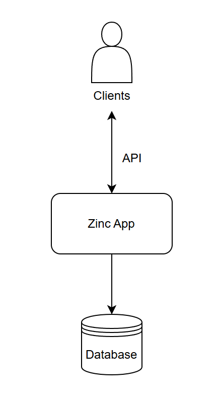
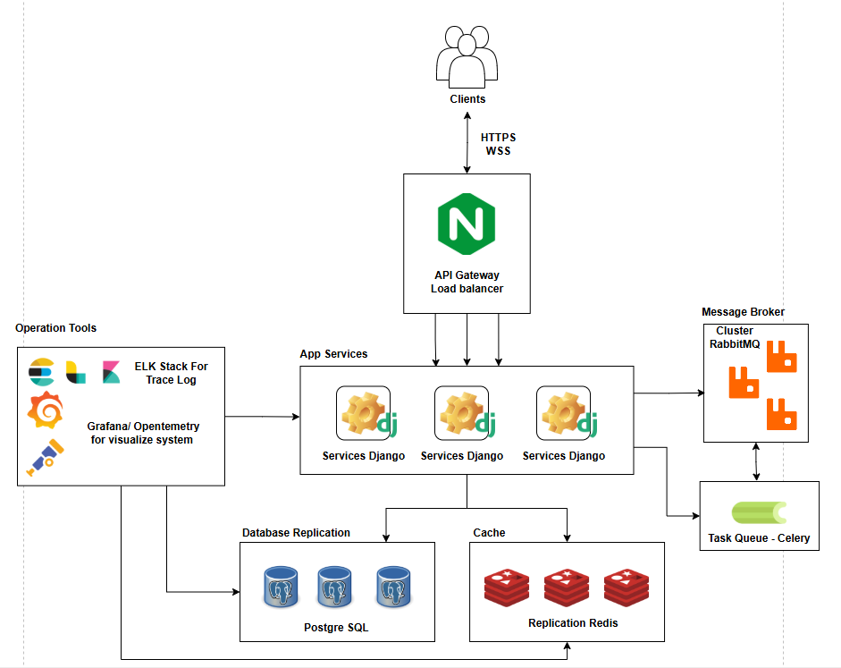
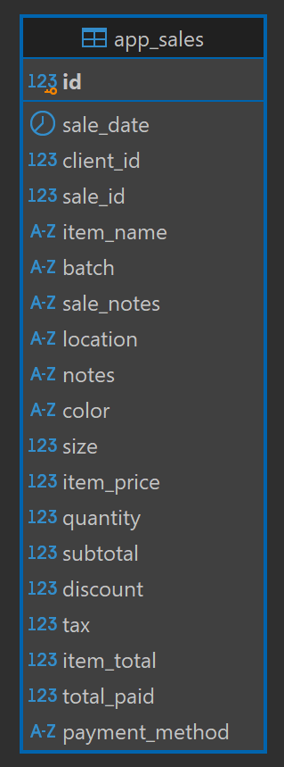
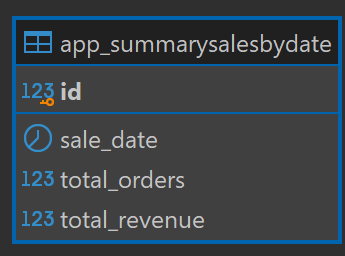

# Architecture Planning
## 1. High-Level Architecture Diagram
### 1.1. Normal Architecture Diagram (This Repository)

### 1.2. Fully Architecture Diagram


## 2. API & Data Model Sketch
### 2.1 API
#### 2.1.1 Import Sales
```
This api using for import sales data and save to database

URL : http://{ip}:{port}/api/sales/import-sales/
Method : POST
Body : (form-data) - file *only csv
```
```
Example :
 
curl --location 'http://{ip}:{port}/api/sales/import-sales/' \
--form 'file=@"/C:/Users/tngeen/Desktop/sales.csv"'

Response : Status 201 Created
{
    "status": 201,
    "message": "success",
    "data": {
        "imported_row": 3322
    }
}
```
#### 2.1.2 Revenue
```
This api get total and average revenue sales in range start date and end date

URL : http://{ip}:{port}/api/metrics/revenue/
Method : GET
Param : 
 - start (date) : Month/Day/Year
 - end (date) : Month/Day/Year
```
```
Example :
 
curl --location 'http://{ip}:{port}/api/metrics/revenue/?start=3%2F1%2F2025&end=3%2F1%2F2025'

Response : Status 200 OK
{
    "status": 200,
    "message": "success",
    "data": {
        "total_revenue_sgd": 5069.044,
        "average_order_value_sg": 55.1
    }
}
```
#### 2.1.3 Revenue Daily
```
This api group by revenue by date in range start date and end date

URL : http://{ip}:{port}/api/metrics/revenue/daily/
Method : GET
Param : 
 - start (date) : Month/Day/Year
 - end (date) : Month/Day/Year
```
```
Example :
 
curl --location 'http://{ip}:{port}/api/metrics/revenue/daily/?start=3%2F1%2F2025&end=3%2F1%2F2025'

Response : Status 200 OK
{
    "status": 200,
    "message": "success",
    "data": [
        {
            "date": "2025-03-01",
            "revenue_sgd": 5069.044
        },
        {
            "date": "2025-03-02",
            "revenue_sgd": 2134.436
        }
    ]
}
```
#### 2.1.4 Health Check
```
This api for health check app with database

URL : http://{ip}:{port}/health/
Method : GET
```
```
Example :
 
curl --location 'http://{ip}:{port}/health'

Response : Status 200 OK
{
    "status": "ok",
    "database": "reachable",
    "time": "2025-05-10T15:29:09.981364"
}
```
### 2.2 Data Model
#### 2.2.1 Table Sales
- *Store order informations*

  
#### 2.2.2 Table SummarySalesByDate
- *Store order informations such as sale_date, total_order, total_revenue and group by sale_date for speed up load report*

  
## 3. Infrastructure Choices
### 3.1 Infrastructure
- **Docker** – (containerization) : ***Use in repository***
- **PostgreSQL** – (Main database) : ***Use in repository***
- **GitHub Actions** – CI/CD (build, test, deploy) : ***Use in repository***
- **Redis** – In-memory data store (cache)
- **Nginx** – (Web server/reverse proxy)
- **RabbitMQ** – (Message broker)
- **ELK Stack – Elasticsearch, Logstash, Kibana** (Tracing and analys log)
- **Grafana** – (Monitoring / Dashboard visualization)
- **OpenTelemetry – Observability framework** (trace, metrics, logs)
### 3.2 Framework
- **Python**
- **Django – Web framework (Python)**
- **Gunicorn – Python WSGI HTTP server**
- **Celery – Task queue (Python library)**

## 4. Scaling & Resilience Strategy
### 4.1 Scalability
To ensure the system can handle increasing loads efficiently, both horizontal and vertical scaling strategies are applied:

**Application Layer:**

Horizontal scaling is achieved by increasing the number of application instances and containers (e.g., using Docker and orchestration tools like Kubernetes or Docker Compose).

This allows better load distribution and fault isolation across multiple service replicas.

**Database Layer:**
Vertical scaling can be used to enhance database performance by upgrading hardware resources (CPU, RAM, IOPS).

Horizontal scaling is achieved through database sharding, which partitions data across multiple database nodes to distribute the load and reduce contention.

This strategy is useful for handling large-scale data and improving read/write throughput.

### 4.2 Resilience
To maintain high availability and fault tolerance, resilience techniques are implemented:

**Database Replication:**

Master-slave or multi-primary replication strategies are used to ensure redundancy and failover capability.

In case of node failure, traffic can be redirected to replica nodes without service interruption.

**Failover & Health Checks:**

Automatic health checks and failover mechanisms are configured at both the application and database levels, ensuring that the system continues operating even if one or more components fail.

## 5. CI/CD & Rollback Plan
### 5.1 CI/CD Pipeline with GitHub Action s
The CI/CD process is managed using GitHub Actions.

The pipeline is split into multiple jobs for clarity and control:

**CI Job:**

- Checks out the source code.
- Builds the Docker image.
- Runs unit and integration tests.
- Executes database migrations (if all tests pass).
- If successful, the pipeline proceeds to the deployment stage.

**CD Job:**
- Deploys the newly built image.
- Uses proper version tagging and environment-specific configuration.

### 5.1 Rollback Strategy
**Image Backup:**

- Before deployment, the previous image version is backed up to enable safe rollback.

**Deployment Flow:**

- If the build, test, and migration steps succeed, the new image is deployed.
- Upon successful deployment, the old image is removed to clean up resources.

**Failure Recovery:**

- If any step in the deployment fails, the system will automatically roll back to the previously backed-up image.

**Blue-Green Deployment :**
A Blue-Green deployment strategy is used to minimize downtime and avoid service disruption.

Traffic is routed to the new environment only after it passes health checks, ensuring zero-downtime releases.

## 6. Observability & SRE
### 6.1 Logging & Tracing
- The ELK Stack (Elasticsearch, Logstash, Kibana) is used to collect, parse, and visualize logs.
- Each request is tagged with a unique EID (Event ID) to enable end-to-end tracing across services.
- This allows for efficient debugging and correlation of logs across distributed components.

### 6.2 Metrics & Monitoring
OpenTelemetry is integrated into the services to collect telemetry data such as:
- Request rates
- Response times
- Error rates
- SQL queries executed

The collected metrics are exported and visualized through Grafana, enabling real-time monitoring and historical analysis.


### 6.3 SRE
- Monitor the number of requests over time and during peak hours to scale up application instances accordingly.
  
- Track the number of database and cache connections to determine whether to increase the connection limit or implement connection pooling.
  
- Observe the number of messages/tasks in the queue to trigger alerts and scale up the number of workers when necessary.
  
- Perform system health checks to send alerts and automatically restart services if issues are detected.

## 7. Trade-Off Discussion
### Base on CAP theorem and User Experience ###

### 7.1 API Import
Recommended to use asynchronous task separation, such as Celery worker or Message Queues, to handle file processing. This allows the system to respond to the user immediately, avoiding screen blocking while waiting for the import API to complete. Notifications to the user can be sent via WebSocket.

**Benefits:** 
- Immediate response avoids wasting the user's time waiting for the API and prevents UI blocking. 
- The task queue offloads work from the API and supports retries in case of failure.

**Drawbacks:** 
- Data is not available immediately, even though a 200 OK response has already been returned to the user.
- Managing task retries in the queue can be complex.

**Implementation:** Use Celery tasks with RabbitMQ in a 3-tier queue structure: main_queue, delay_queue, and dead-letter queue.

### 7.2 API for Report
For APIs that involve large-scale calculations of item counts and revenue, it is recommended to use Online Analytical Processing (OLAP) term. This approach precomputes necessary data periodically (e.g., T-1 day, T-30 minutes, T-1 hour) depending on the use case, reducing the load of real-time, read-heavy operations on the database. These computations should be handled via scheduled background jobs.

**Benefits:**

- Significantly faster API response times for reports

- Reduces real-time computation load on the database when users frequently fetch data

- Enables efficient sharding and clean aggregation of historical data

**Drawbacks:**

- Data consistency is delayed, as precomputed data may not reflect the latest state

- Requires careful management of computation logic and scheduling intervals

**Implementation:**
Use Celery task workers to run background computations and provide two types of APIs:

- A real-time API to show data for the current day (calculating on-the-fly with a fixed range like "today")

- An analytical API to serve historical data from precomputed OLAP results

**Example:**
See api ver2 in the repository for implementation reference.